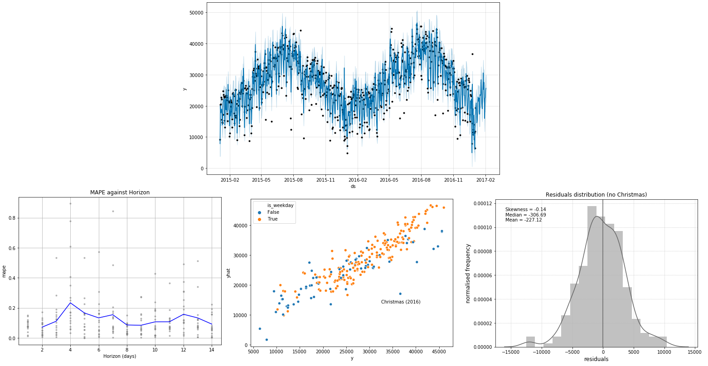

# Forecasting London Bike Shares

This notebook presents a time series analysis of [hourly and daily cycle shares in London](https://www.kaggle.com/hmavrodiev/london-bike-sharing-dataset) from 1/1/2015 to 1/1/2017 and examines how weather conditions influence the number of cycle shares on a daily and hourly basis. The analysis performed was adapted from and influenced by a similar analysis on [cycling counts in Auckland, New Zealand](https://cdn.rawgit.com/nicolasfauchereau/Auckland_Cycling/master/notebooks/Auckland_cycling_and_weather.html) with a few distinct differences:

- The parameters of the forecasting model were tuned to fit the London count data
- Hourly forecasts were produced on top of daily forecasts
- Daily seasonal patterns (conditional on weekday vs weekend) were used to aid the fit of the hourly forecasting model
- [Simulated historical forecasts](https://facebook.github.io/prophet/docs/diagnostics.html) were used to evaluate the models

The [Prophet](https://facebook.github.io/prophet/) package by Facebook was used to perform the time series modelling.

> Fbprophet implements a [Generalized Additive Model](https://en.wikipedia.org/wiki/Generalized_additive_model), and - in a nutshell - models a time-series as the **sum of different components** (non-linear trend, periodic components and holidays or special events) and allows to incorporate **extra-regressors** (categorical or continuous). The reference is [Taylor and Letham, 2017](https://peerj.com/preprints/3190.pdf), see also [this blog post from Facebook research announcing the package](https://research.fb.com/prophet-forecasting-at-scale/).
> > [Dr Nicolas Fauchereau](https://cdn.rawgit.com/nicolasfauchereau/Auckland_Cycling/master/notebooks/Auckland_cycling_and_weather.html)

Daily weekday cycling shares were forecasted with approximately **10% MAPE** in the 2-week-horizon simulated historical forecasts whilst hourly weekday cycling shares were forecasted with approximately **45% MAPE** in the 24-hour-horizon simulated historical forecasts.

## Installation

The major dependency that [Prophet](https://facebook.github.io/prophet/docs/installation.html) has is Pystan. PyStan has its own [installation instructions](https://pystan.readthedocs.io/en/latest/installation_beginner.html). Install pystan with pip before using pip to install fbprophet. Then install the dependencies listed in the requirements.txt file in this repo.

## Usage

After installing all of the required dependencies, all results and plots can be reproduced using the london_bike_share.ipynb notebook.
